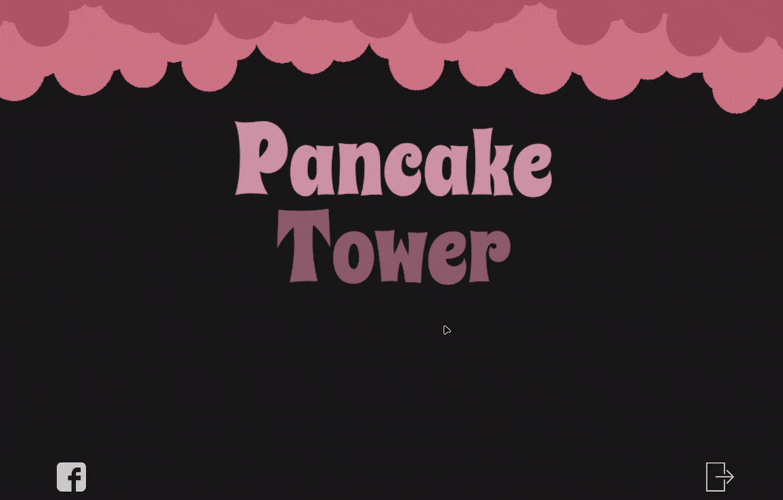

 

~ a puzzle game with level creation support ~

## What is Pancake Tower?
**Pancake Tower** is a puzzle game, where the player has to perform different tasks, depending on the chosen gamemode.

 

There are two gamemodes in Pancake Tower:
 
 
### Puzzle Mode
* Complete the given puzzle, while avoiding death by spikes
* Interact with puzzle elements, and touch speed pads that increase your movement speed
* Puzzles keep increasing in size and difficulty, 10 different puzzle levels

 

### Maze Mode
* Find the exit to the maze in as little time as you can!
* Collect coins to increase your score
* Mazes randomly generated using a recursive division algorithm

 

Besides the gameplay modes, the game also features level creation support, in an in-game built level creator.

### Level Creator
* Easy to use, drag'n'drop interface
* Can play levels immediately after creating them
* Saving/loading level features

 

### Technical description

Pancake Tower was developed using Unity 5.6.1. Scripting was done in C#. The menu assets were done in Photoshop. Theme song courtesy of [Agnet 75](http://jake75gp.wixsite.com/agnet75), who was so kind as to compose it specially for the game. Sound effects created using [Bfxr](http://www.bfxr.net/).

## How to download Pancake Tower

If you already have Unity installed, you may clone the entire repository and open it in Unity. This enables you to play the game, as well as look through the source code, if you're curious about how the game works.

Otherwise, enter the Builds folder in the repo, and download the latest build.
